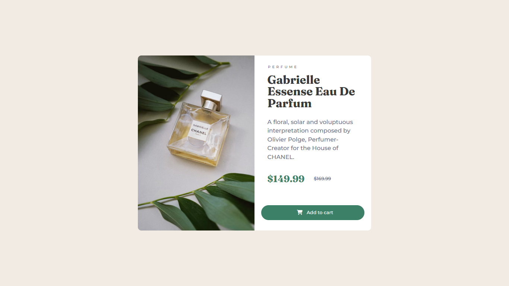
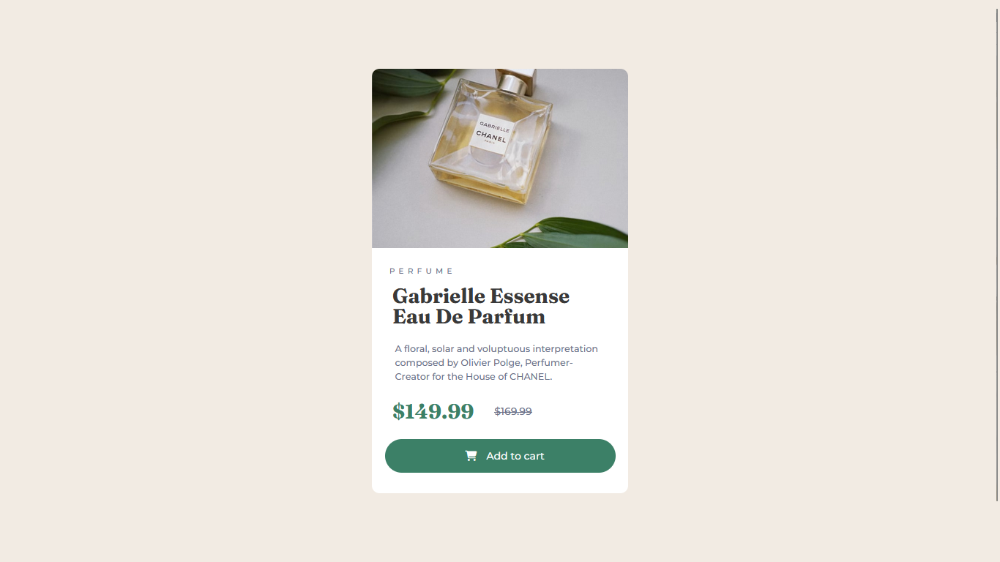

# Frontend Mentor - NFT preview card component solution

**Hey there! This is Nacho!**

This is a solution to the [NFT preview card component challenge on Frontend Mentor](https://www.frontendmentor.io/challenges/nft-preview-card-component-SbdUL_w0U). Frontend Mentor challenges help you improve your coding skills by building realistic projects. 

## Table of contents

- [Overview](#overview)
  - [The challenge](#the-challenge)
  - [Screenshot](#screenshot)
  - [Links](#links)
- [My process](#my-process)
  - [Built with](#built-with)
  - [What I learned](#what-i-learned)
  - [Continued development](#continued-development)
- [Author](#author)

## Overview

### The challenge

Users should be able to:

- View the optimal layout depending on their device's screen size
- See hover states for interactive elements

### Screenshot

 
 

### Links

- Solution URL: [GitHub](https://github.com/FigueroaIgnacio/Product-Preview-Card-Component)

## My process

### Built with

- Semantic HTML5 markup
- CSS
- Flexbox
- CSS Grid
- Mobile-first workflow

### What I learned

I learned more about Semantic HTML
On this project I used emmet and keyboard shortcuts in VS Code

### Continued development

I want to improve the BEM methodology and my productivity with the shortcuts

## Author
- Frontend Mentor - [@FigueroaIgnacio](https://www.frontendmentor.io/profile/FigueroaIgnacio)
